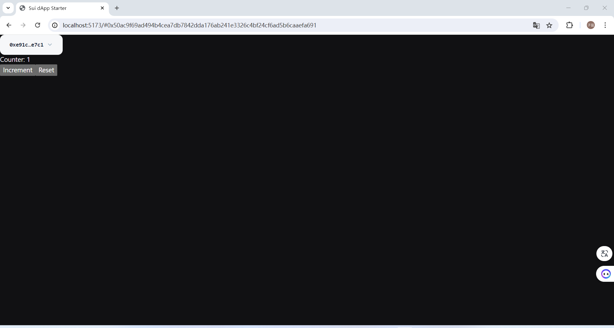

# suimove-learning
## [Counter](Counter)
这是[sui官方示例的一个例子](https://docs.sui.io/guides/developer/app-examples/e2e-counter)，分布式计数器应用程序，涵盖将 Move 代码连接到客户端应用程序的完整端到端流程。该应用程序允许您创建任何人都可以增加的计数器，但只有所有者可以重置。  

代码效果  

## [Plinko](plinko)
这是[sui官方示例的一个例子](https://docs.sui.io/guides/developer/app-examples/plinko)，Plinko游戏,玩家将 Plinko 球扔到一个钉板上，它们随机落入代表不同乘数的槽中,以获得不同数量的sui。

## [Blackjack](blackjack)
这是[sui官方示例的一个例子](https://docs.sui.io/guides/developer/app-examples/blackjack),赌场游戏21点，[游戏规则](https://baike.baidu.com/item/21%E7%82%B9/5481683),这是个单人版的二十一点，玩家与庄家竞争，由系统自动进行。庄家配备了一个公共 BLS 密钥，该密钥在游戏机制中起着核心作用。经销商的操作由对无服务器函数的 HTTP 请求触发。玩家通过在屏幕上与鼠标互动来为游戏生成随机性，然后下注开始游戏。在开始游戏时，向后端（庄家）发出请求，后端（庄家）通过签名并随后向玩家发两张牌和向自己发一张牌来处理它。玩家可以选择 “击中 ”或 “站立”。选择“站立”会触发庄家抽牌，直到总数达到 17 或更高。庄家停止后，智能合约介入比较总数并宣布获胜者。

## [Satoshi_flip](satoshi_flip)
这是[sui官方示例的一个例子](https://docs.sui.io/guides/developer/app-examples/coin-flip),Satoshi Coin Flip 是一个 dApp，它利用可验证随机函数（VRF）在 Sui 区块链上创建公平的硬币游戏。用户（人类）与庄家（模块）进行游戏，并对正面或反面下注。然后，用户要么收到双倍的赌注，要么什么也得不到，具体取决于游戏的结果

## [oracle](oracle)
这是[sui官方示例的一个例子](https://docs.sui.io/guides/developer/app-examples/weather-oracle),这是一个天气预报的智能合约，该合约包括添加城市天气，移除城市，更改城市天气情况，将城市天气数据做成NFT的功能